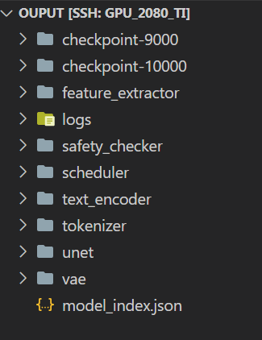

# Prerequisites:

Conda env Python 3.9 <br>
NVIDIA GeForce RTX 3090 Ti or above <br>

# Environment installation:

```
pip install -r requirements.txt
pip install torch==2.1.0 torchvision==0.16.0 torchaudio==2.1.0 --index-url https://download.pytorch.org/whl/cu118
pip install -U xformers --index-url https://download.pytorch.org/whl/cu118
```

(**Note**: If you run this code on other Python or NVIDIA versions, go to https://pytorch.org/get-started/previous-versions/ and get the cuda version which suits your system. For example, in this code, cu118 can run on Python3.9)

# How to run:

### 1. Inference:

(We had provided a simple inference data in the file `test/clean_public_test.csv`, which links with the `train_dataset/train` folder. If you want to infer on another test set, replace them with yours and make sure they have exactly the same format).

To run, change the **model_path** in the file `infer.sh`. The pretrained model folder (if you don't have one, go to Huggingface and find a model card like: https://huggingface.co/runwayml/stable-diffusion-v1-5/tree/main, look for the folder having the file `model_index.json` in the source code) should look like this: <br>

The inference results will be saved in folder `results`.

### 2. Training:

Change the **pretrained_model_name_or_path** and other parameters in the file `train.sh` as your preference. The training weights and infos will be saved in folder `finetunedmodel`.
