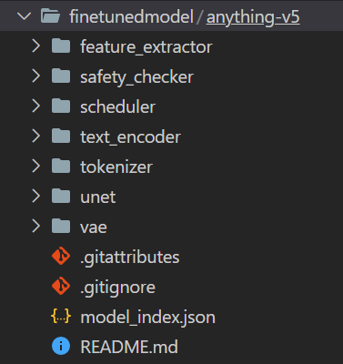
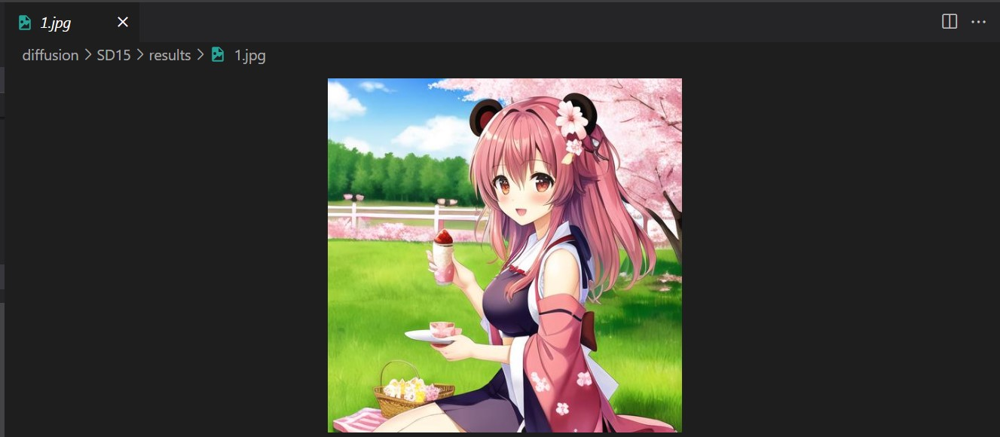

# Anything-v5

The latest, popular and free + open-source anime generative model from China. For more details, check out this link: https://civitai.com/models/9409/or-anything-v5ink

# How to infer

-   Go to folder `finetunedmodel` (please note that you should delete or rename this folder first and clone the repo later as its name is just a placeholder to give you an intuitive example) and clone the weights of Anything-v5 from https://huggingface.co/stablediffusionapi/anything-v5 like this:
    <br>

```
git clone https://huggingface.co/stablediffusionapi/anything-v5
```

Your folder should look like this: <br>
 <br>

-   To infer, change the `infer.sh` file to this:

```
python infer.py \
     --prompts_path="./test/test.asv" \
     --results_path="./results" \
     --model_path="./finetunedmodel/anything-v5" \
```

Note: the `test.asv` file has 3 fields: **file_name, prompt, negative_prompt** ,each sperated by the symbol @. For example, we had already provided a sample tsv file with prompts and negative prompts in the `test` folder.

The result should look like: <br>
<br>
(This image should be in the `results` folder but was placed here instead for easier demonstration).
